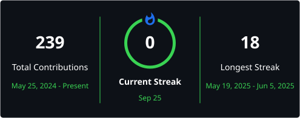

# 👋 Hey, I'm Ekam Singh

## Software Engineer

  Building thoughtful products across the <b>frontend, backend, and intelligent systems</b>.

  
  
  

---

## 🧑‍💻 About Me

I'm a Computer Science student at **IIIT Ranchi** who enjoys understanding how software works from the interface all the way down to the systems behind it.

My experience spans both **frontend and backend engineering**, from building responsive interfaces and collaborative applications to designing APIs, authentication systems, databases, and asynchronous workflows.

I'm particularly interested in the intersection of **software engineering and AI** — currently exploring how reliable, stateful and fault-tolerant systems can be built for agentic workflows.

Outside of building software, I enjoy competitive programming and problem solving.

---

## ⚡ At a Glance

|                          |                                          |
| ------------------------ | ---------------------------------------- |
| 🎓 **Education**         | B.Tech CSE — IIIT Ranchi                 |
| 💼 **Experience**        | Software Engineer Intern — Coding Pandas |
| 🧩 **Problem Solving**   | 800+ problems solved                     |
| ⭐ **CodeChef**           | 3★ · Max Rating 1605                     |
| 🏅 **Flipkart GRID 8.0** | Semi-Finalist                            |
| 🛠️ **Focus**            | Full Stack Engineering · AI · Systems    |

---

## 🛠️ Engineering Stack

### Languages

  

### Frontend

  

### Backend & APIs

  

`REST APIs` · `JWT Authentication` · `MVC` · `Microservices` · `RabbitMQ`

### Databases & Infrastructure

  

### AI & Systems

`LLM APIs` · `Agentic Workflows` · `Embeddings` · `FAISS` · `AsyncIO` · `Pydantic` · `OpenTelemetry`

---

## 📊 GitHub Analytics

  
  

  

---

## 📈 Contribution Activity

  

---

## 🏆 Problem Solving

---

## 🏅 Milestones

* **800+** algorithmic problems solved across LeetCode, CodeChef, Gfg and Codeforces
* **3★ CodeChef** — Max Rating **1605**
* **Pupil Codeforces** — Max Rating **1230**
* **Semi-Finalist — Flipkart GRID 8.0**
* **Ex-Software Engineer Intern — Coding Pandas**

---

## 🤝 Let's Connect

  <i>Build with curiosity. Engineer with intent.</i>

